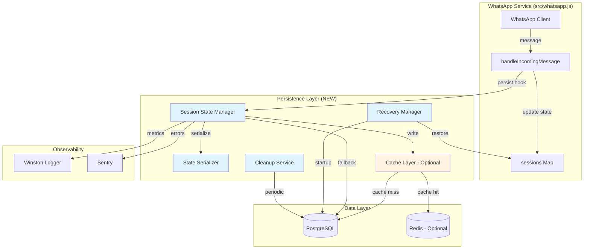

# Design Document: Session State Persistence

## Overview

This design document specifies the architecture for migrating the Mex-End WhatsApp astrology lead management system from in-memory session storage to PostgreSQL-backed persistence with optional Redis caching. The system currently stores all user conversation state in memory (Map objects in src/whatsapp.js), causing complete data loss on server restarts and preventing horizontal scalability.

The persistence layer will be implemented as a minimal, non-invasive addition to the existing 3,936-line whatsapp.js monolith, using hook points for integration rather than refactoring. The design prioritizes backward compatibility, zero data loss, and sub-100ms persistence latency while supporting up to 5 concurrent server instances and 500 active conversations per admin.

### Design Goals

1. **Zero Data Loss**: Persist conversation state after every message with graceful shutdown handling
2. **Minimal Invasiveness**: Integrate through hook points without refactoring whatsapp.js
3. **Performance**: <100ms p95 persistence latency, <50ms added message processing overhead
4. **Scalability**: Support 5+ server instances sharing state via database
5. **Reliability**: Circuit breaker pattern with fallback to in-memory storage
6. **Observability**: Comprehensive logging and metrics via Winston and Sentry
7. **Safe Rollout**: Feature flag for gradual migration with rollback capability

### Key Constraints

- Preserve existing session.users object structure and all 17 user properties
- No changes to handleIncomingMessage function logic
- Support gradual migration (some sessions persisted, others in-memory)
- Maintain existing idle timer and cleanup behavior
- Work with existing PostgreSQL pool (config/database.js)
- Integrate with existing Winston logger and Sentry monitoring

## Architecture

### High-Level Architecture



### Data Flow

**Message Processing Flow (Write Path)**:
1. WhatsApp client receives message
2. handleIncomingMessage processes message and updates session.users[phone]
3. Persistence hook calls SessionStateManager.persistState(adminId, phone, userState)
4. StateSerializer converts user object to JSON
5. If Redis enabled: write to Redis cache (async, fire-and-forget)
6. Write to PostgreSQL (with retry logic)
7. Update last_activity_at timestamp
8. Log metrics and errors

**Session Recovery Flow (Read Path)**:
1. Server starts, RecoveryManager.recoverSessions() called
2. Query PostgreSQL for active sessions (last_activity_at within USER_IDLE_TTL_MS)
3. For each row: deserialize session_data to user object
4. Restore to sessions.get(admin_id).users[phone]
5. Log recovery statistics

**Cleanup Flow**:
1. SessionCleanupService runs every 15 minutes
2. Delete sessions where last_activity_at > USER_IDLE_TTL_MS
3. Delete sessions where user.finalized = true
4. Batch deletes (1000 records max per run)
5. Log cleanup statistics

### Component Architecture

The persistence layer consists of five main components:

1. **SessionStateManager**: Orchestrates persistence operations, retry logic, circuit breaker
2. **StateSerializer**: Handles JSON serialization/deserialization with type preservation
3. **RecoveryManager**: Restores sessions on startup
4. **SessionCleanupService**: Periodic cleanup of expired sessions
5. **CacheLayer**: Optional Redis caching for high-performance reads

## Components and Interfaces

### 1. SessionStateManager

**Responsibility**: Orchestrate state persistence with retry logic, circuit breaker, and fallback.

**Interface**:
```javascript
class SessionStateManager {
  constructor({ db, logger, sentry, cacheLayer, config })
  
  // Core operations
  async persistState(adminId, phone, userState)
  async loadState(adminId, phone)
  async deleteState(adminId, phone)
  
  // Bulk operations
  async persistAllStates(adminId, usersMap)
  async loadAllStates(adminId)
  
  // Circuit breaker
  isCircuitOpen()
  resetCircuit()
  
  // Metrics
  getMetrics()
}
```

**Key Behaviors**:
- Async persistence (non-blocking)
- Retry with exponential backoff (3 attempts: 100ms, 200ms, 400ms)
- Circuit breaker opens after 10 consecutive failures
- Batching: coalesce rapid updates within 500ms window
- Metrics: track latency, errors, cache hit rate
- Fallback: continue with in-memory on circuit open

**Configuration**:
```javascript
{
  enabled: process.env.ENABLE_SESSION_PERSISTENCE === 'true',
  retryAttempts: 3,
  retryDelayMs: 100,
  batchWindowMs: 500,
  circuitBreakerThreshold: 10,
  circuitBreakerResetMs: 60000
}
```

### 2. StateSerializer

**Responsibility**: Convert user state objects to/from JSON with type preservation.

**Interface**:
```javascript
class StateSerializer {
  serialize(userState)
  deserialize(jsonString)
  
  // Internal helpers
  _serializeValue(value)
  _deserializeValue(value, key)
}
```

**Serialization Rules**:
- Date objects → ISO 8601 strings (with `__type: 'Date'` marker)
- undefined → null
- Functions → excluded
- Circular references → excluded (with warning)
- All other types → JSON.stringify

**Deserialization Rules**:
- ISO 8601 strings with `__type: 'Date'` → Date objects
- null → null (caller handles defaults)
- Missing properties → undefined

**User State Properties** (17 total):
```javascript
{
  step: string,                    // Current conversation step
  data: object,                    // Step-specific data
  isReturningUser: boolean,        // Has previous conversation
  clientId: number,                // Database contact ID
  name: string,                    // User's name
  email: string,                   // User's email
  assignedAdminId: number,         // Admin handling conversation
  greetedThisSession: boolean,     // Greeting sent flag
  resumeStep: string,              // Step to resume from
  awaitingResumeDecision: boolean, // Waiting for resume choice
  lastUserMessageAt: Date,         // Last message timestamp
  partialSavedAt: Date,            // Last partial save timestamp
  finalized: boolean,              // Lead/order completed
  idleTimer: null,                 // Timer reference (not persisted)
  automationDisabled: boolean,     // Manual mode flag
  aiConversationHistory: array,    // AI chat history
  responseLanguage: string         // Detected language code
}
```

### 3. RecoveryManager

**Responsibility**: Restore active sessions on server startup.

**Interface**:
```javascript
class RecoveryManager {
  constructor({ db, logger, serializer, config })
  
  async recoverSessions()
  async recoverSessionsForAdmin(adminId)
  
  // Statistics
  getRecoveryStats()
}
```

**Recovery Process**:
1. Query active sessions: `SELECT * FROM conversation_states WHERE last_activity_at > NOW() - INTERVAL '6 hours'`
2. Group by admin_id
3. For each session: deserialize and restore to sessions Map
4. Skip corrupted sessions (log error, continue)
5. Return statistics: { totalRecovered, failedRecoveries, durationMs }

**Performance Target**: 1000 sessions in <5 seconds

### 4. SessionCleanupService

**Responsibility**: Periodic cleanup of expired and finalized sessions.

**Interface**:
```javascript
class SessionCleanupService {
  constructor({ db, logger, config })
  
  start()
  stop()
  async runCleanup()
  
  // Statistics
  getCleanupStats()
}
```

**Cleanup Logic**:
```sql
DELETE FROM conversation_states
WHERE last_activity_at < NOW() - INTERVAL '6 hours'
   OR (session_data->>'finalized')::boolean = true
LIMIT 1000
```

**Schedule**: Every 15 minutes (configurable via CLEANUP_INTERVAL_MS)

### 5. CacheLayer (Optional)

**Responsibility**: Redis-based caching for high-performance reads.

**Interface**:
```javascript
class CacheLayer {
  constructor({ redisClient, logger, config })
  
  async get(adminId, phone)
  async set(adminId, phone, userState, ttlMs)
  async delete(adminId, phone)
  async invalidate(adminId)
  
  // Pub/sub for multi-instance cache invalidation
  async publishInvalidation(adminId, phone)
  subscribeToInvalidations(callback)
  
  // Health check
  isAvailable()
}
```

**Cache Key Format**: `conversation:{adminId}:{phone}`

**TTL**: Matches USER_IDLE_TTL_MS (6 hours default)

**Fallback**: If Redis unavailable, fall through to database

**Multi-Instance Invalidation**:
- Publish to Redis channel: `conversation:invalidate`
- Message format: `{adminId}:{phone}`
- All instances subscribe and invalidate local cache

## Data Models

### Database Schema

**Table: conversation_states**

```sql
CREATE TABLE IF NOT EXISTS conversation_states (
  id SERIAL PRIMARY KEY,
  admin_id INTEGER NOT NULL REFERENCES admins(id) ON DELETE CASCADE,
  phone VARCHAR(20) NOT NULL,
  session_data JSONB NOT NULL,
  last_activity_at TIMESTAMP WITH TIME ZONE NOT NULL DEFAULT NOW(),
  created_at TIMESTAMP WITH TIME ZONE NOT NULL DEFAULT NOW(),
  updated_at TIMESTAMP WITH TIME ZONE NOT NULL DEFAULT NOW(),
  
  -- Composite unique constraint
  CONSTRAINT unique_admin_phone UNIQUE (admin_id, phone)
);

-- Indexes for performance
CREATE INDEX IF NOT EXISTS idx_conversation_states_admin_id 
  ON conversation_states(admin_id);

CREATE INDEX IF NOT EXISTS idx_conversation_states_last_activity 
  ON conversation_states(last_activity_at);

CREATE INDEX IF NOT EXISTS idx_conversation_states_admin_activity 
  ON conversation_states(admin_id, last_activity_at);

-- GIN index for JSONB queries (optional, for future queries)
CREATE INDEX IF NOT EXISTS idx_conversation_states_session_data 
  ON conversation_states USING GIN(session_data);

-- Trigger to update updated_at
CREATE OR REPLACE FUNCTION update_conversation_states_updated_at()
RETURNS TRIGGER AS $$
BEGIN
  NEW.updated_at = NOW();
  RETURN NEW;
END;
$$ LANGUAGE plpgsql;

CREATE TRIGGER trigger_conversation_states_updated_at
  BEFORE UPDATE ON conversation_states
  FOR EACH ROW
  EXECUTE FUNCTION update_conversation_states_updated_at();
```

**Migration Script** (migrations/001_create_conversation_states.sql):
```sql
-- Up migration
BEGIN;

CREATE TABLE IF NOT EXISTS conversation_states (
  id SERIAL PRIMARY KEY,
  admin_id INTEGER NOT NULL REFERENCES admins(id) ON DELETE CASCADE,
  phone VARCHAR(20) NOT NULL,
  session_data JSONB NOT NULL,
  last_activity_at TIMESTAMP WITH TIME ZONE NOT NULL DEFAULT NOW(),
  created_at TIMESTAMP WITH TIME ZONE NOT NULL DEFAULT NOW(),
  updated_at TIMESTAMP WITH TIME ZONE NOT NULL DEFAULT NOW(),
  CONSTRAINT unique_admin_phone UNIQUE (admin_id, phone)
);

CREATE INDEX idx_conversation_states_admin_id ON conversation_states(admin_id);
CREATE INDEX idx_conversation_states_last_activity ON conversation_states(last_activity_at);
CREATE INDEX idx_conversation_states_admin_activity ON conversation_states(admin_id, last_activity_at);
CREATE INDEX idx_conversation_states_session_data ON conversation_states USING GIN(session_data);

CREATE OR REPLACE FUNCTION update_conversation_states_updated_at()
RETURNS TRIGGER AS $$
BEGIN
  NEW.updated_at = NOW();
  RETURN NEW;
END;
$$ LANGUAGE plpgsql;

CREATE TRIGGER trigger_conversation_states_updated_at
  BEFORE UPDATE ON conversation_states
  FOR EACH ROW
  EXECUTE FUNCTION update_conversation_states_updated_at();

COMMIT;
```

**Rollback Script** (migrations/001_rollback_conversation_states.sql):
```sql
-- Down migration
BEGIN;

DROP TRIGGER IF EXISTS trigger_conversation_states_updated_at ON conversation_states;
DROP FUNCTION IF EXISTS update_conversation_states_updated_at();
DROP TABLE IF EXISTS conversation_states CASCADE;

COMMIT;
```

### JSONB Storage Format

**Example session_data**:
```json
{
  "step": "awaiting_name",
  "data": {
    "selectedProduct": "birth_chart",
    "quantity": 1,
    "appointmentType": "consultation"
  },
  "isReturningUser": false,
  "clientId": 12345,
  "name": "John Doe",
  "email": "john@example.com",
  "assignedAdminId": 1,
  "greetedThisSession": true,
  "resumeStep": null,
  "awaitingResumeDecision": false,
  "lastUserMessageAt": {
    "__type": "Date",
    "value": "2024-01-15T10:30:00.000Z"
  },
  "partialSavedAt": {
    "__type": "Date",
    "value": "2024-01-15T10:25:00.000Z"
  },
  "finalized": false,
  "automationDisabled": false,
  "aiConversationHistory": [
    {"role": "user", "content": "Hello"},
    {"role": "assistant", "content": "Hi! How can I help?"}
  ],
  "responseLanguage": "en"
}
```

### Redis Cache Format

**Key**: `conversation:{adminId}:{phone}`

**Value**: JSON string (same as session_data)

**TTL**: USER_IDLE_TTL_MS (6 hours default)

**Example**:
```
Key: conversation:1:+1234567890
Value: {"step":"awaiting_name","data":{...},...}
TTL: 21600 seconds
```

## Integration Points

### Hook Point 1: After Message Processing

**Location**: src/whatsapp.js, end of handleIncomingMessage function

**Current Code** (approximate line 3900):
```javascript
async function handleIncomingMessage({ session, message, from, body, rawText }) {
  // ... 1000+ lines of message processing ...
  
  // Update user state
  user.lastUserMessageAt = new Date();
  
  // Existing code ends here
}
```

**Integration**:
```javascript
async function handleIncomingMessage({ session, message, from, body, rawText }) {
  // ... existing message processing ...
  
  user.lastUserMessageAt = new Date();
  
  // NEW: Persist state hook
  if (sessionStateManager.isEnabled()) {
    sessionStateManager.persistState(
      session.adminId,
      phone,
      user
    ).catch(err => {
      logger.error('Failed to persist session state', {
        adminId: session.adminId,
        phone,
        error: err.message
      });
    });
  }
}
```

### Hook Point 2: Server Startup

**Location**: src/whatsapp.js, startWhatsApp function

**Current Code** (approximate line 1415):
```javascript
async function startWhatsApp(adminId) {
  const session = createSession(adminId);
  sessions.set(adminId, session);
  
  // Initialize client
  session.client = createClient(adminId);
  attachClientEvents(session);
  
  await session.client.initialize();
  
  return session;
}
```

**Integration**:
```javascript
async function startWhatsApp(adminId) {
  const session = createSession(adminId);
  sessions.set(adminId, session);
  
  // NEW: Recover persisted sessions
  if (sessionStateManager.isEnabled()) {
    try {
      const recovered = await recoveryManager.recoverSessionsForAdmin(adminId);
      session.users = recovered.users || {};
      logger.info('Recovered sessions for admin', {
        adminId,
        count: Object.keys(session.users).length
      });
    } catch (err) {
      logger.error('Failed to recover sessions', {
        adminId,
        error: err.message
      });
    }
  }
  
  session.client = createClient(adminId);
  attachClientEvents(session);
  
  await session.client.initialize();
  
  return session;
}
```

### Hook Point 3: Session Cleanup

**Location**: src/whatsapp.js, cleanupSessions function

**Current Code** (approximate line 43):
```javascript
const cleanupSessions = () => {
  const now = Date.now();
  for (const [adminId, session] of sessions.entries()) {
    const users = session.users || {};
    for (const [key, user] of Object.entries(users)) {
      const lastSeen = user?.lastUserMessageAt || 0;
      if (lastSeen && now - lastSeen > USER_IDLE_TTL_MS) {
        if (user?.idleTimer) clearTimeout(user.idleTimer);
        delete users[key];
      }
    }
  }
};
```

**Integration**:
```javascript
const cleanupSessions = () => {
  const now = Date.now();
  for (const [adminId, session] of sessions.entries()) {
    const users = session.users || {};
    for (const [key, user] of Object.entries(users)) {
      const lastSeen = user?.lastUserMessageAt || 0;
      if (lastSeen && now - lastSeen > USER_IDLE_TTL_MS) {
        if (user?.idleTimer) clearTimeout(user.idleTimer);
        
        // NEW: Delete from database
        if (sessionStateManager.isEnabled()) {
          sessionStateManager.deleteState(adminId, key).catch(err => {
            logger.warn('Failed to delete expired session state', {
              adminId,
              phone: key,
              error: err.message
            });
          });
        }
        
        delete users[key];
      }
    }
  }
};
```

### Hook Point 4: Graceful Shutdown

**Location**: New file src/shutdown.js

**Implementation**:
```javascript
import logger from '../config/logger.js';
import { sessionStateManager } from './persistence/SessionStateManager.js';
import { sessions } from './whatsapp.js';

let isShuttingDown = false;

export async function gracefulShutdown(signal) {
  if (isShuttingDown) return;
  isShuttingDown = true;
  
  logger.info(`Received ${signal}, starting graceful shutdown...`);
  
  try {
    // Persist all active sessions
    if (sessionStateManager.isEnabled()) {
      const promises = [];
      for (const [adminId, session] of sessions.entries()) {
        if (session.users) {
          promises.push(
            sessionStateManager.persistAllStates(adminId, session.users)
          );
        }
      }
      
      await Promise.allSettled(promises);
      logger.info('All sessions persisted');
    }
    
    // Close database connections
    await db.end();
    
    logger.info('Graceful shutdown complete');
    process.exit(0);
  } catch (err) {
    logger.error('Error during graceful shutdown', { error: err.message });
    process.exit(1);
  }
}

// Register signal handlers
process.on('SIGTERM', () => gracefulShutdown('SIGTERM'));
process.on('SIGINT', () => gracefulShutdown('SIGINT'));
```

## Error Handling

### Error Categories

1. **Serialization Errors**: Invalid user state objects
2. **Database Errors**: Connection failures, query timeouts, constraint violations
3. **Cache Errors**: Redis unavailable, connection timeout
4. **Recovery Errors**: Corrupted session data, deserialization failures

### Error Handling Strategies

**Serialization Errors**:
- Log error with full context (admin_id, phone, state keys)
- Return null from serialize()
- Skip persistence for that message
- Continue processing (don't crash)

**Database Errors**:
- Retry with exponential backoff (3 attempts)
- If all retries fail: log error, emit Sentry alert
- Circuit breaker: open after 10 consecutive failures
- When circuit open: fall back to in-memory only
- Auto-reset circuit after 60 seconds

**Cache Errors**:
- Log warning (not error - cache is optional)
- Fall through to database
- Continue operation (cache is best-effort)

**Recovery Errors**:
- Log error for corrupted session
- Skip that session, continue with others
- Don't fail startup
- Report statistics: recovered vs failed

### Circuit Breaker Pattern

```javascript
class CircuitBreaker {
  constructor(threshold = 10, resetMs = 60000) {
    this.threshold = threshold;
    this.resetMs = resetMs;
    this.failures = 0;
    this.state = 'CLOSED'; // CLOSED, OPEN, HALF_OPEN
    this.lastFailureTime = null;
  }
  
  recordSuccess() {
    this.failures = 0;
    this.state = 'CLOSED';
  }
  
  recordFailure() {
    this.failures++;
    this.lastFailureTime = Date.now();
    
    if (this.failures >= this.threshold) {
      this.state = 'OPEN';
      logger.error('Circuit breaker opened', { failures: this.failures });
      
      // Auto-reset after timeout
      setTimeout(() => {
        this.state = 'HALF_OPEN';
        this.failures = 0;
        logger.info('Circuit breaker half-open, attempting recovery');
      }, this.resetMs);
    }
  }
  
  isOpen() {
    return this.state === 'OPEN';
  }
}
```

### Retry Logic

```javascript
async function retryWithBackoff(fn, attempts = 3, delayMs = 100) {
  for (let i = 0; i < attempts; i++) {
    try {
      return await fn();
    } catch (err) {
      if (i === attempts - 1) throw err;
      
      const backoff = delayMs * Math.pow(2, i);
      logger.warn(`Retry attempt ${i + 1}/${attempts} after ${backoff}ms`, {
        error: err.message
      });
      
      await new Promise(resolve => setTimeout(resolve, backoff));
    }
  }
}
```

## Performance Optimization

### Write Path Optimizations

**1. Batching**: Coalesce rapid updates within 500ms window
```javascript
class BatchWriter {
  constructor(flushIntervalMs = 500) {
    this.pending = new Map(); // key -> {adminId, phone, userState, timestamp}
    this.timer = null;
    this.flushIntervalMs = flushIntervalMs;
  }
  
  schedule(adminId, phone, userState) {
    const key = `${adminId}:${phone}`;
    this.pending.set(key, { adminId, phone, userState, timestamp: Date.now() });
    
    if (!this.timer) {
      this.timer = setTimeout(() => this.flush(), this.flushIntervalMs);
    }
  }
  
  async flush() {
    const batch = Array.from(this.pending.values());
    this.pending.clear();
    this.timer = null;
    
    // Write all in parallel
    await Promise.allSettled(
      batch.map(item => this._writeToDB(item))
    );
  }
}
```

**2. Async Fire-and-Forget**: Don't block message processing
```javascript
// Don't await persistence
sessionStateManager.persistState(adminId, phone, user).catch(err => {
  logger.error('Persistence failed', { error: err.message });
});
```

**3. Connection Pooling**: Reuse existing pool from config/database.js
- Max 20 connections
- Min 2 connections
- 30s idle timeout

### Read Path Optimizations

**1. Redis Caching**: 80% hit rate target
- Cache active conversations (recently accessed)
- TTL matches USER_IDLE_TTL_MS
- Async cache warming on recovery

**2. Index Optimization**:
- Composite index on (admin_id, last_activity_at) for recovery queries
- GIN index on session_data for future JSONB queries

**3. Bulk Loading**: Load all admin sessions in single query
```sql
SELECT phone, session_data
FROM conversation_states
WHERE admin_id = $1
  AND last_activity_at > NOW() - INTERVAL '6 hours'
```

### Database Query Optimization

**Upsert Pattern** (INSERT ... ON CONFLICT):
```sql
INSERT INTO conversation_states (admin_id, phone, session_data, last_activity_at)
VALUES ($1, $2, $3, NOW())
ON CONFLICT (admin_id, phone)
DO UPDATE SET
  session_data = EXCLUDED.session_data,
  last_activity_at = EXCLUDED.last_activity_at
```

**Batch Cleanup** (LIMIT to avoid long transactions):
```sql
DELETE FROM conversation_states
WHERE id IN (
  SELECT id FROM conversation_states
  WHERE last_activity_at < NOW() - INTERVAL '6 hours'
  LIMIT 1000
)
```

## Security

### Data Protection

1. **Admin Isolation**: Foreign key constraint ensures admin_id integrity
2. **Parameterized Queries**: All queries use $1, $2 placeholders (no SQL injection)
3. **No Sensitive Logging**: Phone numbers and emails masked in logs
4. **Redis TLS**: Enable TLS for Redis connections in production
5. **Data Retention**: Auto-delete sessions older than 90 days

### Access Control

**Database Level**:
- Application uses existing database user with limited permissions
- No direct admin access to conversation_states table
- Foreign key CASCADE ensures orphaned sessions deleted when admin deleted

**Application Level**:
- SessionStateManager enforces admin_id in all queries
- No cross-admin data access possible
- Cache keys include admin_id for isolation

### Compliance

**GDPR**:
- When contact deleted, cascade delete conversation_states via foreign key
- Support for data export (query conversation_states by phone)
- Support for data deletion (DELETE FROM conversation_states WHERE phone = ?)

**Data Retention**:
- Automatic cleanup after USER_IDLE_TTL_MS (6 hours default)
- Optional extended retention policy (90 days max)
- Configurable via CONVERSATION_STATE_RETENTION_DAYS env var

## Testing Strategy

The testing strategy employs a dual approach combining property-based testing for universal correctness guarantees and unit testing for specific examples and edge cases.

### Property-Based Testing

Property-based tests will use the **fast-check** library for JavaScript, configured to run a minimum of 100 iterations per property. Each test will be tagged with a comment referencing the design document property number.

**Library**: fast-check (npm install --save-dev fast-check)

**Configuration**:
```javascript
import fc from 'fast-check';

// Minimum 100 iterations per property test
const testConfig = { numRuns: 100 };
```

**Test Tagging Format**:
```javascript
// Feature: session-state-persistence, Property 1: Round-trip serialization
test('property: serialize then deserialize preserves state', () => {
  fc.assert(
    fc.property(userStateArbitrary, (userState) => {
      // property test implementation
    }),
    testConfig
  );
});
```

### Unit Testing

Unit tests will focus on:
- Specific examples demonstrating correct behavior
- Edge cases (empty states, missing properties, corrupted data)
- Error conditions (database failures, serialization errors)
- Integration points (hook execution, graceful shutdown)

**Framework**: Jest or Vitest

**Coverage Targets**:
- StateSerializer: 100% (critical for data integrity)
- SessionStateManager: 90%
- RecoveryManager: 85%
- SessionCleanupService: 80%

### Integration Testing

**Database Integration**:
- Test against real PostgreSQL (Docker container)
- Verify schema creation, indexes, constraints
- Test concurrent writes from multiple connections
- Verify foreign key CASCADE behavior

**Redis Integration**:
- Test cache hit/miss scenarios
- Test fallback when Redis unavailable
- Test pub/sub invalidation across instances

**End-to-End**:
- Simulate full message flow with persistence
- Test server restart with session recovery
- Test graceful shutdown with state preservation

### Load Testing

**Tools**: Artillery or k6

**Scenarios**:
1. 100 concurrent conversations, 10 messages each
2. 500 active sessions, recovery on startup
3. Sustained load: 50 messages/second for 5 minutes

**Performance Assertions**:
- p95 persistence latency < 100ms
- p99 persistence latency < 500ms
- Recovery: 1000 sessions in < 5 seconds
- Message processing overhead < 50ms

### Chaos Engineering

**Failure Scenarios**:
1. Database connection loss during message processing
2. Redis connection loss with active cache
3. Server crash with unsaved state
4. Network partition between app and database
5. Corrupted session data in database

**Tools**: Chaos Mesh or manual fault injection

**Validation**:
- System continues operating (degrades gracefully)
- No data loss after recovery
- Circuit breaker activates correctly
- Metrics and alerts fire appropriately


## Correctness Properties

A property is a characteristic or behavior that should hold true across all valid executions of a system—essentially, a formal statement about what the system should do. Properties serve as the bridge between human-readable specifications and machine-verifiable correctness guarantees.

### Property Reflection

After analyzing all 107 acceptance criteria, I identified the following redundancies and consolidations:

**Redundancy Analysis**:
1. Properties 2.1-2.5 (individual serialization rules) are subsumed by Property 2.7 (round-trip property)
2. Property 8.2 (preserve all 17 properties) is redundant with Property 2.7 (round-trip property)
3. Properties 4.3, 4.4, 4.5 (recovery details) can be consolidated into a single comprehensive recovery property
4. Properties 6.2, 6.3, 6.4 (cache read/write behavior) can be consolidated into cache correctness properties
5. Properties 10.1-10.6 (logging requirements) can be consolidated into comprehensive logging properties
6. Properties 14.1, 14.2, 14.3, 14.6 (fallback behaviors) can be consolidated into resilience properties

**Consolidated Properties**: The following properties provide unique validation value without redundancy.

### Property 1: Round-Trip Serialization Preserves State

*For any* valid conversation state object (containing any combination of the 17 user properties: step, data, isReturningUser, clientId, name, email, assignedAdminId, greetedThisSession, resumeStep, awaitingResumeDecision, lastUserMessageAt, partialSavedAt, finalized, automationDisabled, aiConversationHistory, responseLanguage), serializing then deserializing should produce an equivalent state object with all properties preserved, Date objects correctly restored, and undefined values handled consistently.

**Validates: Requirements 2.1, 2.2, 2.3, 2.5, 2.7, 8.1, 8.2**

### Property 2: Serialization Excludes Non-Serializable Values

*For any* conversation state object containing functions or circular references, serialization should exclude these non-serializable properties without throwing errors, and the resulting JSON should contain only serializable data.

**Validates: Requirements 2.4**

### Property 3: Serialization Errors Return Null

*For any* input that causes serialization to fail (malformed objects, deeply nested structures exceeding limits), the serializer should return null and log the error without crashing the application.

**Validates: Requirements 2.8**

### Property 4: State Persistence After Message Processing

*For any* user message that updates conversation state, the SessionStateManager should persist the updated state to the database asynchronously (non-blocking) with the last_activity_at timestamp updated to the current time.

**Validates: Requirements 3.1, 3.2, 3.3**

### Property 5: Persistence Retry With Exponential Backoff

*For any* database persistence failure, the SessionStateManager should retry up to 3 times with exponential backoff (100ms, 200ms, 400ms), and if all retries fail, should log the error and emit a monitoring alert without crashing.

**Validates: Requirements 3.4, 3.6**

### Property 6: Batching Rapid State Updates

*For any* sequence of state updates for the same (admin_id, phone) occurring within a 500ms window, the SessionStateManager should coalesce them into a single database write operation containing the most recent state.

**Validates: Requirements 3.7**

### Property 7: Session Recovery Loads Active States

*For any* server startup, the RecoveryManager should load all conversation states from the database where last_activity_at is within the USER_IDLE_TTL_MS window, restore them to the in-memory sessions Map grouped by admin_id, and log recovery statistics (total recovered, failed recoveries, duration).

**Validates: Requirements 4.1, 4.2, 4.3, 4.4, 4.5**

### Property 8: Recovery Skips Corrupted Sessions

*For any* session with corrupted or invalid session_data that fails deserialization during recovery, the RecoveryManager should log the error, skip that specific session, and continue loading other sessions without failing the startup process.

**Validates: Requirements 4.6, 14.2**

### Property 9: Cleanup Deletes Expired and Finalized Sessions

*For any* cleanup operation, the SessionCleanupService should delete all conversation states where either (a) last_activity_at is older than USER_IDLE_TTL_MS, or (b) the session_data indicates finalized=true, limiting deletions to 1000 records per batch, and logging the count of deleted sessions.

**Validates: Requirements 5.2, 5.3, 5.4, 5.6**

### Property 10: Cleanup Failures Are Logged and Retried

*For any* cleanup operation that fails due to database errors, the SessionCleanupService should log the error without crashing and automatically retry on the next scheduled run (15 minutes later).

**Validates: Requirements 5.7**

### Property 11: Cache TTL Matches Configuration

*For any* conversation state cached in Redis (when Redis is configured), the cache entry should have a TTL equal to USER_IDLE_TTL_MS, ensuring cache expiration aligns with session expiration policy.

**Validates: Requirements 6.1**

### Property 12: Cache Read-Through Pattern

*For any* state read operation when Redis is configured, the CacheLayer should first check Redis, and on cache miss, load from the database and populate the cache with the retrieved value.

**Validates: Requirements 6.2, 6.4**

### Property 13: Cache Write-Through Pattern

*For any* state write operation when Redis is configured, the CacheLayer should update both Redis (with appropriate TTL) and the database, ensuring both storage layers remain consistent.

**Validates: Requirements 6.3**

### Property 14: Cache Key Format Consistency

*For any* cache operation, the CacheLayer should use keys in the format "conversation:{admin_id}:{phone}", ensuring consistent key naming across all cache operations.

**Validates: Requirements 6.5**

### Property 15: Redis Failure Fallback

*For any* Redis connection failure or timeout, the CacheLayer should fall back to direct database access without throwing errors, allowing the system to continue operating with degraded performance.

**Validates: Requirements 6.6, 14.3**

### Property 16: Database as Single Source of Truth

*For any* multi-instance deployment, all server instances should read from and write to the PostgreSQL database as the authoritative source of conversation state, with concurrent updates handled via database row-level locking and last-write-wins conflict resolution based on updated_at timestamps.

**Validates: Requirements 7.1, 7.2, 7.3**

### Property 17: Single Instance Per User Conversation

*For any* user conversation (identified by admin_id and phone), only one server instance should actively process messages for that conversation at any given time, preventing concurrent modification conflicts.

**Validates: Requirements 7.5**

### Property 18: Cache Invalidation Across Instances

*For any* cache invalidation event when Redis pub/sub is configured, the CacheLayer should publish an invalidation message to the "conversation:invalidate" channel, and all server instances should receive and process the invalidation, ensuring cache consistency across the cluster.

**Validates: Requirements 7.6**

### Property 19: State Consistency Across Instances

*For any* state update in a multi-instance deployment, all server instances should eventually observe the same conversation state when querying the database, ensuring eventual consistency across the cluster.

**Validates: Requirements 7.7**

### Property 20: Backward Compatible State Structure

*For any* persisted conversation state, the structure should match the existing session.users[phone] object format, allowing the persistence layer to integrate with existing code without requiring changes to message handling logic.

**Validates: Requirements 8.1**

### Property 21: In-Memory Cleanup Behavior Preserved

*For any* session cleanup operation, the existing in-memory cleanup behavior (clearing idle timers, removing expired users from sessions Map) should continue to function identically whether persistence is enabled or disabled.

**Validates: Requirements 8.5**

### Property 22: Idle Timer Functionality Preserved

*For any* user conversation with an active idle timer, the timer should continue to function as before (triggering partial saves, cleanup), with persistence operations occurring independently without interfering with timer behavior.

**Validates: Requirements 8.6**

### Property 23: Gradual Migration Support

*For any* system state where some sessions use persistence (ENABLE_SESSION_PERSISTENCE=true) and others remain in-memory only, both types of sessions should function correctly without interference, allowing gradual migration and rollback.

**Validates: Requirements 8.7, 12.4**

### Property 24: Graceful Shutdown Persists All States

*For any* server shutdown triggered by SIGTERM or SIGINT, the SessionStateManager should persist all active conversation states from the sessions Map to the database before process termination, completing all writes within 10 seconds and logging any sessions that could not be persisted.

**Validates: Requirements 9.1, 9.3, 9.4**

### Property 25: Restart Restores Shutdown States

*For any* server restart following a graceful shutdown, the RecoveryManager should restore all conversation states that were active at shutdown time (last_activity_at within USER_IDLE_TTL_MS), ensuring 100% conversation continuity across deployments.

**Validates: Requirements 9.5, 9.6, 9.7**

### Property 26: Comprehensive Operation Logging

*For any* persistence operation (save, load, delete), the SessionStateManager should log the operation with admin_id, phone (masked), operation type, duration, and outcome (success/failure), enabling full observability of persistence layer behavior.

**Validates: Requirements 10.1**

### Property 27: Metrics Emission

*For any* persistence operation, the SessionStateManager should emit metrics including state_save_duration, state_load_duration, cache_hit_rate, and persistence_errors, enabling performance monitoring and alerting.

**Validates: Requirements 10.2**

### Property 28: Slow Operation Warnings

*For any* persistence operation that exceeds 100ms duration, the SessionStateManager should log a warning with full context (admin_id, phone, duration, operation type), enabling identification of performance bottlenecks.

**Validates: Requirements 10.3**

### Property 29: Retry Exhaustion Error Logging

*For any* persistence operation that fails after all retry attempts are exhausted, the SessionStateManager should log an error with full context and stack trace, enabling debugging of persistent failures.

**Validates: Requirements 10.4**

### Property 30: Recovery Statistics Logging

*For any* session recovery operation on startup, the RecoveryManager should log statistics including total_sessions_recovered, recovery_duration_ms, and failed_recoveries, enabling monitoring of recovery performance and reliability.

**Validates: Requirements 10.5**

### Property 31: Cleanup Statistics Logging

*For any* cleanup operation, the SessionCleanupService should log statistics including sessions_deleted, cleanup_duration_ms, and any errors encountered, enabling monitoring of cleanup effectiveness.

**Validates: Requirements 10.6**

### Property 32: Sentry Error Reporting

*For any* persistence error when Sentry is configured, the SessionStateManager should report the error to Sentry with full context (admin_id, phone, error message, stack trace, operation type), enabling centralized error tracking and alerting.

**Validates: Requirements 10.7**

### Property 33: Sensitive Data Masking in Logs

*For any* log entry generated by the persistence layer, sensitive customer data (email addresses, phone numbers beyond last 4 digits, personal details) should be masked or redacted, preventing exposure of PII in log files.

**Validates: Requirements 13.2**

### Property 34: Parameterized Query Usage

*For any* database query executed by the persistence layer, the query should use parameterized placeholders ($1, $2, etc.) rather than string concatenation, preventing SQL injection vulnerabilities.

**Validates: Requirements 13.3**

### Property 35: Admin Isolation Enforcement

*For any* database query for conversation states, the query should include an admin_id filter in the WHERE clause, ensuring admins can only access their own conversation states and preventing cross-admin data leakage.

**Validates: Requirements 13.4**

### Property 36: Retention Policy Enforcement

*For any* cleanup operation with retention policy enabled, conversation states with last_activity_at older than the configured retention period (default 90 days) should be deleted, ensuring compliance with data retention policies.

**Validates: Requirements 13.6**

### Property 37: GDPR Cascade Deletion

*For any* contact deletion from the database, associated conversation states should be automatically deleted via the foreign key CASCADE constraint, ensuring GDPR compliance for data deletion requests.

**Validates: Requirements 13.7**

### Property 38: Database Failure Fallback and Retry

*For any* database connection failure, the SessionStateManager should fall back to in-memory storage, continue processing messages without persistence, retry database connection every 30 seconds, and automatically resume persistence when the connection is restored.

**Validates: Requirements 14.1, 14.6**

### Property 39: Circuit Breaker Activation

*For any* sequence of 10 consecutive persistence failures, the SessionStateManager should open the circuit breaker, switch to in-memory-only mode, log a critical alert, and automatically attempt to close the circuit after 60 seconds by testing with a single operation.

**Validates: Requirements 14.4, 14.5**

### Property 40: System Availability During Degradation

*For any* persistence layer degradation (database slow, Redis unavailable, circuit breaker open), the system should maintain availability for message processing by falling back to in-memory storage, ensuring zero downtime even when persistence is compromised.

**Validates: Requirements 14.7**

